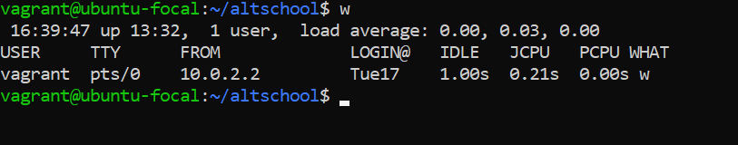
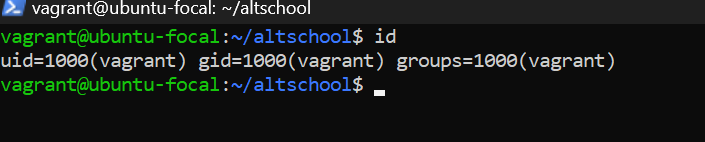
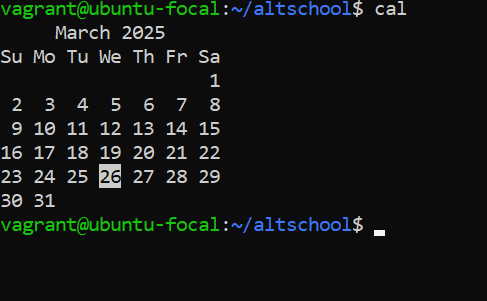
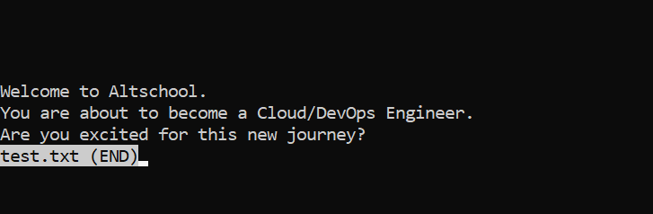
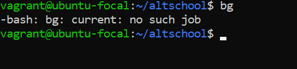
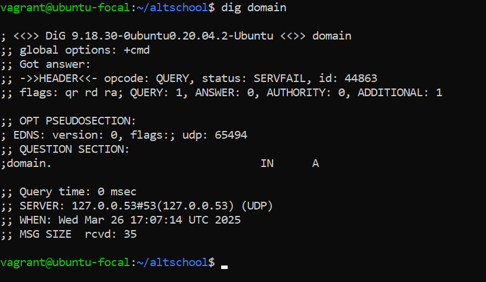
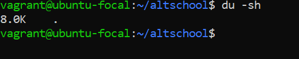
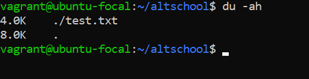
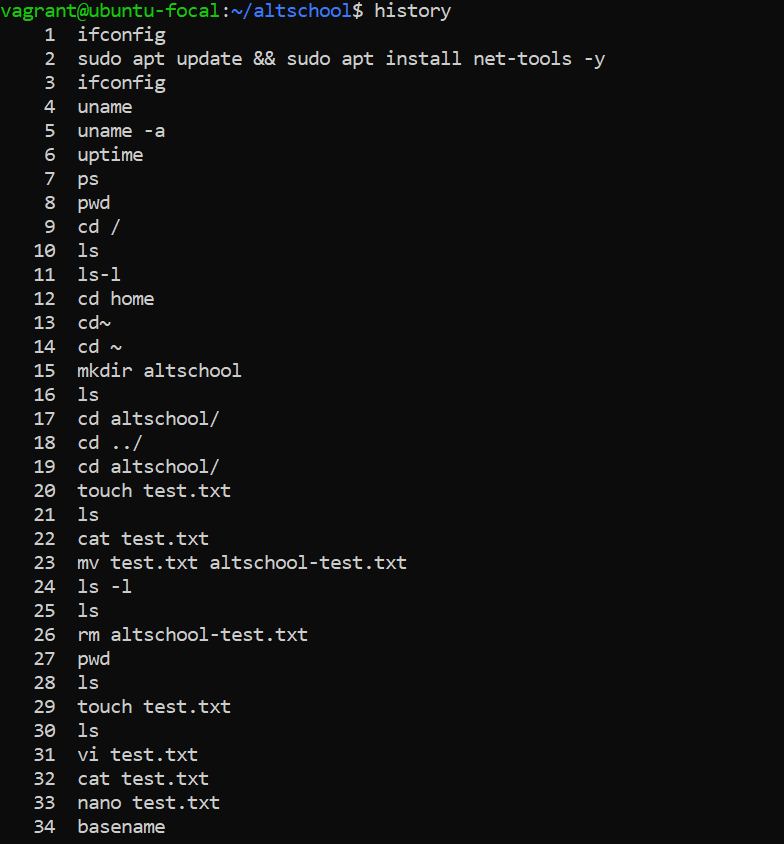
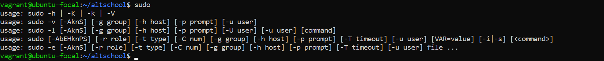

# Exercise 2: 10 More Linux Commands

## 1. `w` - Show Who Is Logged In and What They Are Doing

The `w` command displays a list of users currently logged into the system along with details like login time, idle time, and what they are doing.

## 2. `id` - Display User and Group IDs

The `id` command prints the current user’s **UID** (User ID), **GID** (Group ID), and **group memberships**.

## 3. `cal` - Show This Month’s Calendar

The `cal` command prints a simple **calendar** of the current month. If a year is specified, it prints the calendar for that year.

## 4. `less` - Browse Through a Text File

The `less` command allows users to **scroll** through the contents of a file **without editing it**. It is useful for reading large files.

## 5. `bg` - Resume a Stopped Job in the Background

The `bg` command resumes a suspended process in the **background**, allowing the terminal to be used for other tasks.

## 6. `dig` - Get DNS Information for a Domain

The `dig` command retrieves **DNS records** for a given domain, useful for troubleshooting network issues.

## 7. `du -sh` - Display Total Disk Usage of the Current Directory

The `du -sh` command shows the **total size** of the current directory in a **human-readable format**.

## 8. `du -ah` - Show Disk Usage for All Files and Directories

The `du -ah` command lists the disk usage of **all** files and folders inside the current directory.

## 9. `history` - Show a List of Past Commands

The `history` command lists **previously executed commands** in the terminal session.

## 10. `sudo` - Run Commands with Superuser Privileges

The `sudo` command allows **regular users** to run commands **as an administrator (root)**.

